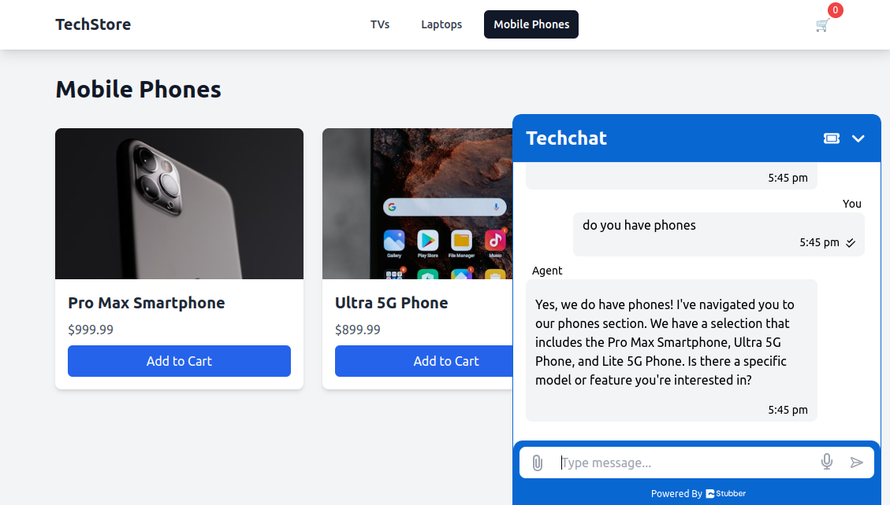

# Stubber Webchat Demo - Ecommerce Site

This demo application shows how the Stubber Webchat component can be integrated into an ecommerce site to achieve a seamless customer experience.

The demo shows :

1. Control of the page from the Stubber Agent Flow
2. Passing of page context with every chat message from the page
3. Triggering of events from the page to the Stubber Agent Flow

## Installation

Installation consists of setting up the Stubber webchat profile, the Stubber template and installing the demo site.

### Setup Stubber Template

1. Create a new template in your Stubber org name it "Ecommerce Webchat Demo"
2. Go to the **View JSON** mode for the `default` context and copy in the contents of the `templates/default.json` file in the JSON editor.
3. Switch back to the flow view
4. Switch to the `create` context
5. You should see a default create stub, open the stub.
6. Click to copy the stubref and save it somewhere as you'll need it in the next section.
7. Switch to the **View JSON** mode for the `create` context
8. Copy in the contents of the `template/_create.json` file in the JSON editor.

### Setup Stubber Webchat Profile

1. Create a new profile in the [manage application](https://manage.stubber.com/_/configs/notifications/webchat/profiles/new)
2. Name the profile
3. Under **Routing Settings** set the option `Send webchat traffic to stub` and set the stubref from the previous section.
4. Under **Admin Settings** set the opening message to : `Welcome to the Ecommerce Webchat Demo`
5. Under **Display Settings** set the webchat title to `Techchat` and set the Automatically open chat window option
6. Click create
7. Copy the webchat **Profile UUID** for use in the next section

### Install the Demo Site

1. Clone this repository `git clone git@github.com:stubber/stubber-public-webchat-demo-ecommerce.git`
2. Run `npm install` to install the dependencies
3. Copy the `.env.example` file to `.env`
4. Configure the environment variables in the `.env` file, set your profile uuid and set the branch to `draft`
5. Run `npm run dev` to start the application
6. The webchat should now create stubs when you start a new chat
